# 🧠 BlockMind — AI Crypto Advisor

<div align="center">

### A personalized crypto dashboard powered by AI

**Track the market. Discover relevant content. Get insights tailored to you.**

<br />

[](https://react.dev/)
[](https://www.typescriptlang.org/)
[](https://nodejs.org/)
[](https://www.mongodb.com/atlas)
[](https://vercel.com/)
[](https://render.com/)

### 🚀 [Live Demo](https://block-mind-ai-crypto-advisor.vercel.app)

</div>

---

## About BlockMind

**BlockMind** is a personalized crypto investor dashboard that combines live market data, crypto news, AI-generated insights and user preferences in one place.

Instead of showing every user the same information, BlockMind creates a dashboard experience based on the user's selected crypto assets, investor style and preferred types of content.

After a short onboarding process, users receive a personalized dashboard containing:

- Live cryptocurrency prices and 24-hour market movement
- Relevant crypto market news
- A personalized AI-generated daily insight
- A dynamic crypto meme
- 👍👎 Feedback controls for future recommendation improvements
- Crypto search and individual coin details
- Editable personalization settings

The goal of the project was to build a complete end-to-end experience while exploring how onboarding preferences and user feedback can be used to personalize financial content.

---

## Application Preview

### Personalized Dashboard

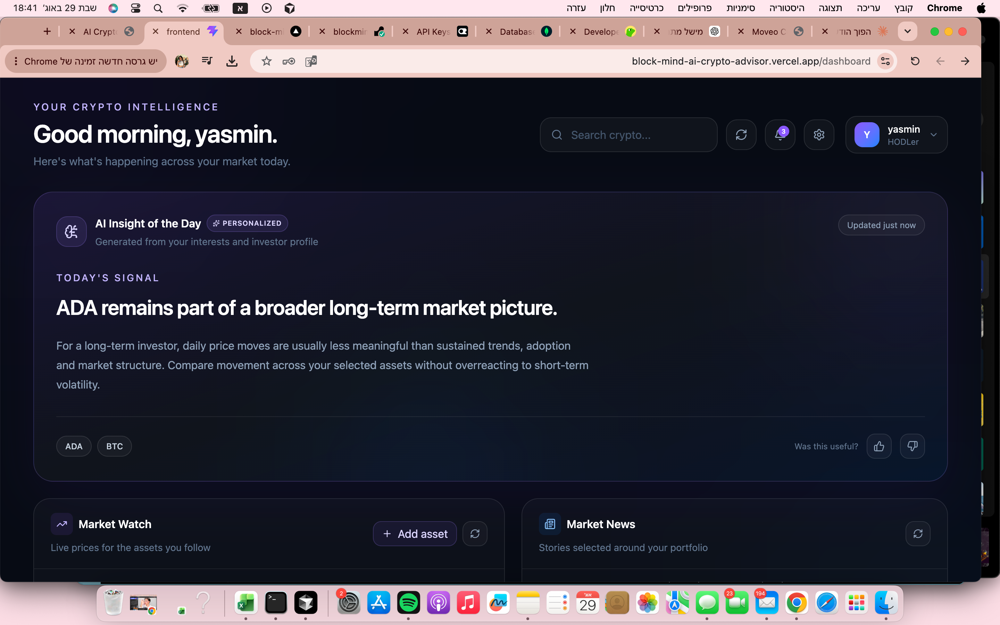

The main dashboard combines the user's preferences, market information and AI-generated content into one personalized experience.

### Market Watch & News

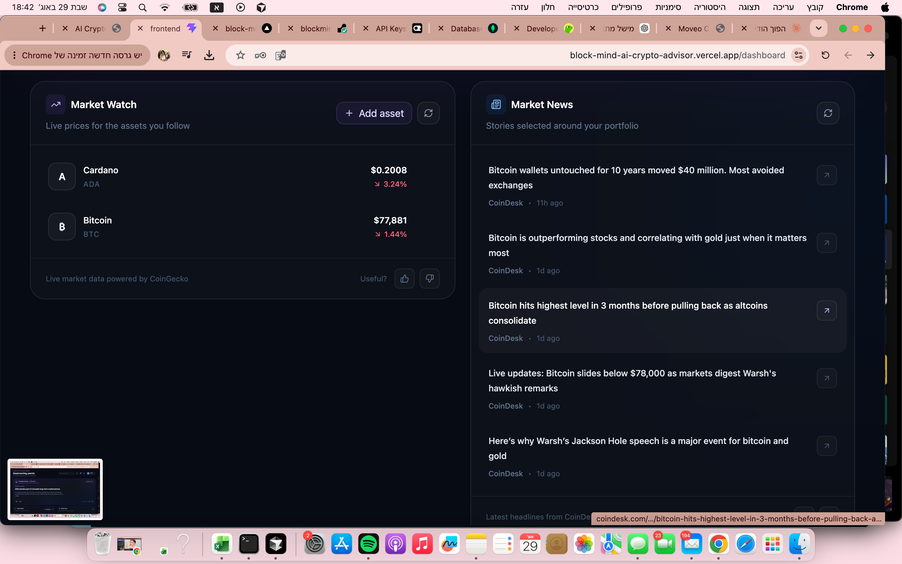

Live prices for selected assets are displayed alongside recent crypto headlines.

### Daily Crypto Meme

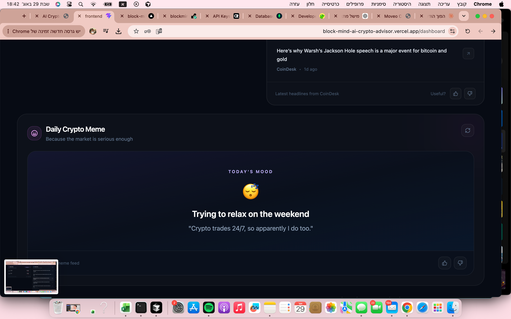

A dynamically selected crypto meme adds a lighter element to the dashboard.

---

## Onboarding & Personalization

New users complete a three-step onboarding flow before entering the dashboard.

### Step 1 — Choose Crypto Assets

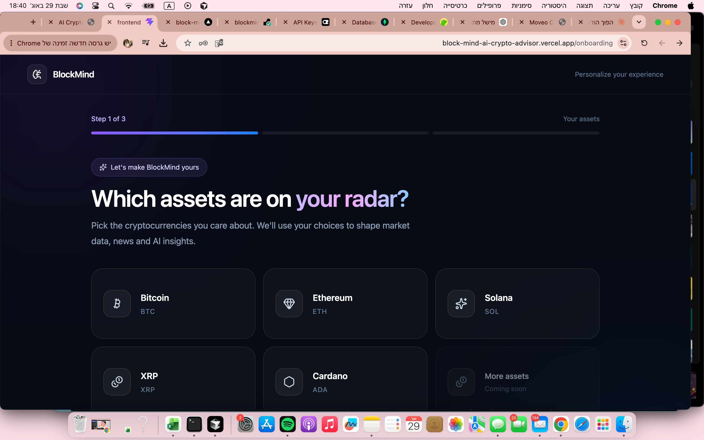

Users select the cryptocurrencies they want BlockMind to follow.

### Step 2 — Choose Investor Style

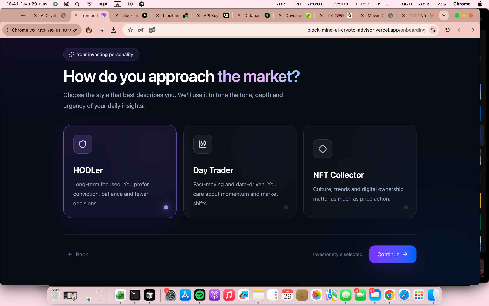

Users choose the investor profile that best represents them, such as HODLer, Day Trader or NFT Collector.

### Step 3 — Choose Content Preferences

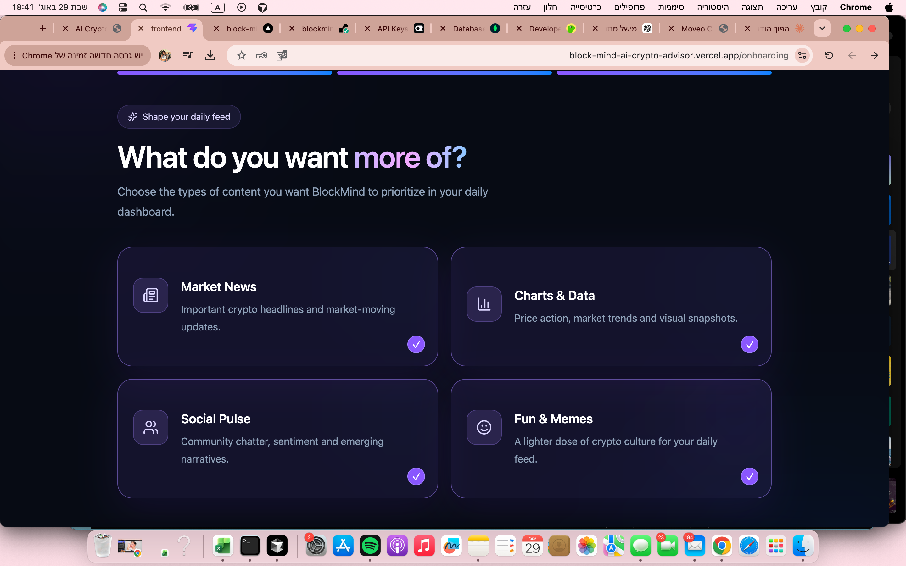

Users select which types of content they want BlockMind to prioritize.

These onboarding choices are stored in MongoDB and later used for dashboard and AI personalization.

---

## Main Features

###  Authentication

BlockMind includes a complete authentication flow with:

- User registration
- Login
- Password hashing
- JWT-based authentication
- Protected frontend routes
- Backend authentication middleware
- Email format validation
- Password length validation

### Sign In

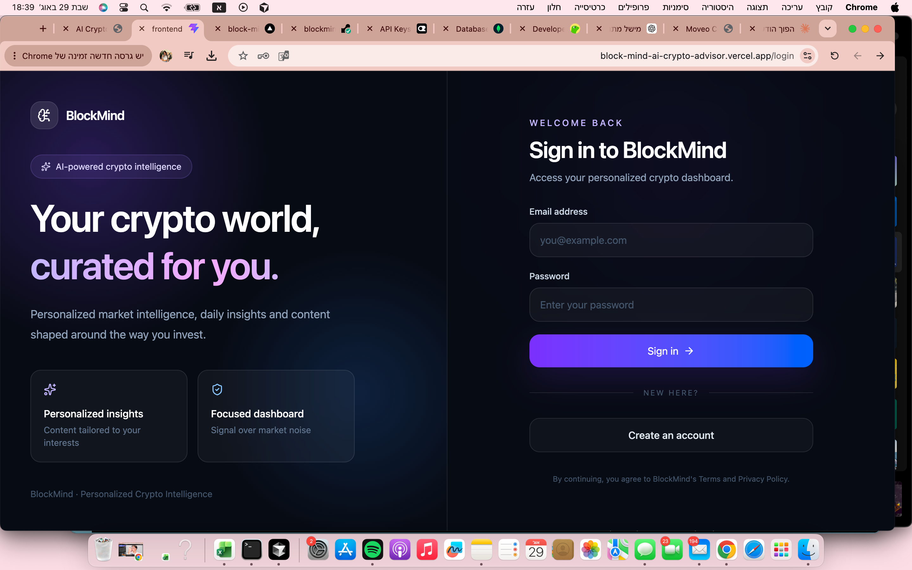

### Sign Up

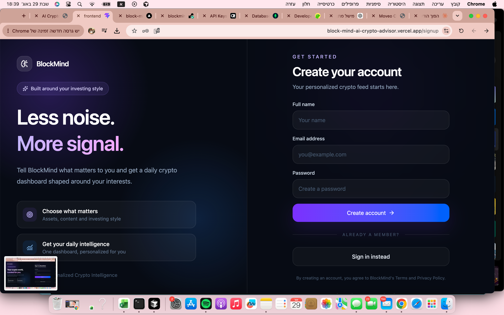

---

###  AI Insight of the Day

BlockMind generates a personalized daily crypto insight based on the user's:

- Selected crypto assets
- Investor style
- Content preferences

The AI content is designed to be educational and descriptive rather than financial advice.

AI responses are validated before being displayed. If the AI provider is temporarily unavailable or returns an invalid response, BlockMind can return a safe fallback instead of breaking the dashboard.

Valid daily insights are stored in MongoDB so they do not need to be regenerated every time the dashboard loads.

---

###  Market Watch

The Market Watch section displays live cryptocurrency market information for the user's selected assets.

Data includes:

- Current USD price
- 24-hour percentage change
- Personalized asset selection

Users can also add additional cryptocurrencies to their followed assets.

Market data is retrieved through the CoinGecko API and cached on the backend to reduce unnecessary external requests.

---

###  Market News

The dashboard displays recent cryptocurrency news from CoinDesk.

Users can:

- View recent headlines
- Open the original article
- Refresh the news feed
- Give positive or negative feedback

---

###  Crypto Search

Users can search for cryptocurrencies directly from the dashboard.

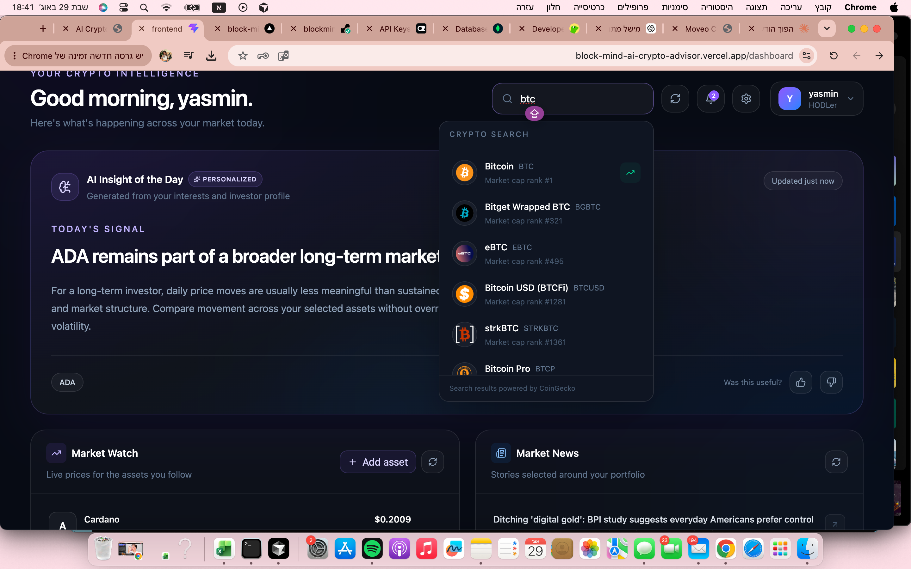

Search results include the cryptocurrency name, symbol and market-cap rank and allow users to navigate directly to a dedicated coin page.

---

###  Coin Details

Selecting a cryptocurrency opens its dedicated market information page.

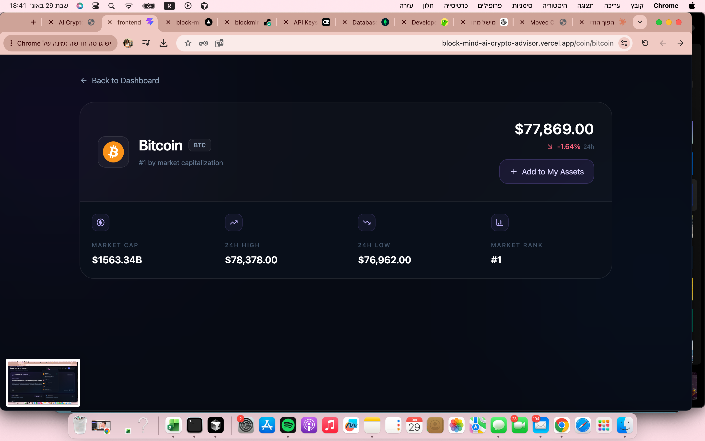

The page includes:

- Current price
- Market capitalization
- Market-cap rank
- 24-hour high
- 24-hour low
- 24-hour price change
- Option to add the cryptocurrency to the user's followed assets

Coin data is cached on the backend to improve reliability and reduce unnecessary external API requests.

---

###  Daily Crypto Meme

The dashboard includes a crypto meme selected dynamically from a curated collection.

The meme provides a lighter component alongside the market information and can change when dashboard content is refreshed.

Users can also provide 👍 or 👎 feedback on the displayed meme.

---

### ⚙️ Personalization Settings

Users are not locked into the choices they made during onboarding.

They can later update their followed assets, investor style and content preferences from the settings page.

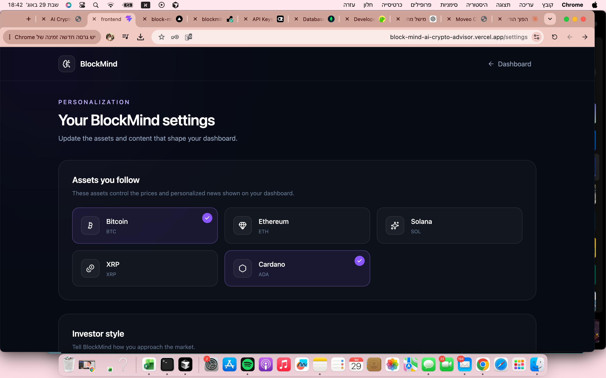

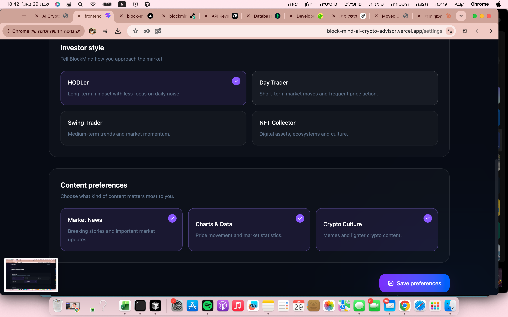

Changes are persisted in MongoDB and used to update the personalized dashboard experience.

---

###  Notifications

BlockMind includes a personalized notification interface for relevant dashboard updates.

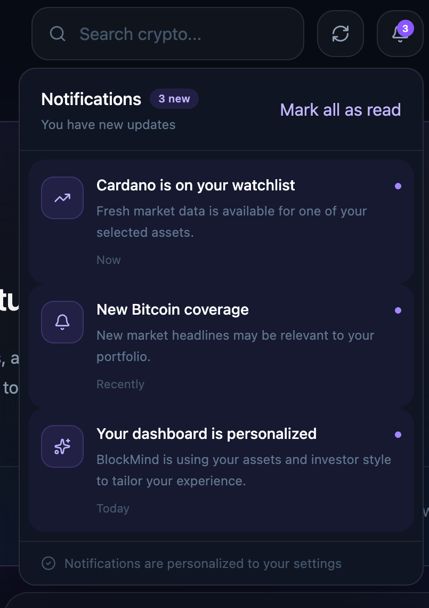

Notifications reflect information related to the user's followed assets and personalized experience.

---

## Feedback System

Each major dashboard section supports **thumbs up 👍 / thumbs down 👎 feedback**.

Feedback is supported for:

- AI insights
- Crypto memes
- Market news
- Coin-price content

Each feedback record is stored in MongoDB and associated with:

- The authenticated user
- Content type
- Content identifier
- The user's vote
- Timestamps

This provides a foundation for improving future recommendations using actual user behavior rather than onboarding preferences alone.

---

## Future Recommendation & Training Process

The current version stores feedback but does not directly train a machine-learning model.

A future recommendation pipeline could combine onboarding preferences with historical feedback to create increasingly personalized recommendations.

A possible process would be:

1. Combine each user's onboarding preferences with historical feedback.
2. Associate positive and negative votes with assets, content types and content metadata.
3. Convert these interactions into preference signals.
4. Use those signals to rank future dashboard content.
5. Evaluate recommendation quality using training and validation datasets.
6. Continuously update user preference weights as additional feedback is collected.

For example, repeated positive feedback on Ethereum-related news could increase the ranking of similar ETH content for that user.

Negative feedback should be treated as a signal rather than an absolute rule because a single dislike may depend on context.

In the future, this data could support recommendation algorithms, ranking models or more advanced AI prompt personalization.

---

## If I Had More Time

Given more development time, I would continue improving BlockMind beyond the scope of the current assignment.

Some features I would explore next include:

- Automatically personalizing and re-ranking content based on stored feedback
- Making memes more personalized based on selected assets and investor style
- Customizable cryptocurrency price alerts
- A simple portfolio and watchlist performance view
- Historical price charts on individual coin pages
- More detailed market statistics and analytics
- Improved notification logic based on real market events
- Automated frontend and backend testing
- Additional monitoring and error handling for external APIs
- More advanced AI personalization based on previous user interactions

For this version, I focused on completing the core assignment requirements, building a clean end-to-end experience and making sure the deployed application is stable and usable.

---

## Tech Stack

### Frontend

- React
- TypeScript
- Vite
- Tailwind CSS
- React Router
- Lucide Icons

### Backend

- Node.js
- Express
- TypeScript
- JWT Authentication
- REST API

### Database

- MongoDB Atlas
- Mongoose

### External Services

- **CoinGecko API** — cryptocurrency prices, search and coin details
- **CoinDesk RSS** — cryptocurrency market news
- **OpenRouter** — personalized AI-generated insights

### Deployment

- **Vercel** — frontend
- **Render** — backend API
- **MongoDB Atlas** — cloud database

---

## Architecture

```text
┌──────────────────────┐
│     React Client     │
│  Vite + TypeScript   │
└──────────┬───────────┘
           │
           │ HTTPS / REST API
           ▼
┌──────────────────────┐
│   Express Backend    │
│     TypeScript       │
├──────────────────────┤
│ Authentication       │
│ Personalization      │
│ Market Services      │
│ AI Insight Service   │
│ Feedback System      │
└───────┬──────────────┘
        │
        ├──────────────► CoinGecko
        │
        ├──────────────► CoinDesk
        │
        ├──────────────► OpenRouter
        │
        ▼
┌──────────────────────┐
│    MongoDB Atlas     │
│                      │
│ Users                │
│ AI Insights          │
│ Feedback             │
└──────────────────────┘
```

---

## Project Structure

```text
BlockMind-AI-Crypto-advisor/
│
├── frontend/
│   ├── src/
│   │   ├── components/
│   │   ├── pages/
│   │   ├── services/
│   │   └── ...
│   └── package.json
│
├── backend/
│   ├── src/
│   │   ├── controllers/
│   │   ├── middleware/
│   │   ├── models/
│   │   ├── routes/
│   │   ├── services/
│   │   └── server.ts
│   └── package.json
│
├── docs/
│   └── screenshots/
│
├── .gitignore
└── README.md
```

---

## Live Application

| Service | URL |
|---|---|
| **Frontend** | [block-mind-ai-crypto-advisor.vercel.app](https://block-mind-ai-crypto-advisor.vercel.app) |
| **Backend API** | [blockmind-api.onrender.com](https://blockmind-api.onrender.com) |
| **API Health Check** | [blockmind-api.onrender.com/health](https://blockmind-api.onrender.com/health) |

> **Note:** The backend is hosted on Render's free tier. The first request after a period of inactivity may take a few seconds while the service wakes up.

---

## Running the Project Locally

### 1. Clone the repository

```bash
git clone https://github.com/michellecain31/BlockMind-AI-Crypto-advisor.git
cd BlockMind-AI-Crypto-advisor
```

### 2. Backend Setup

```bash
cd backend
npm install
```

Create a `.env` file inside the `backend` directory:

```env
MONGODB_URI=your_mongodb_connection_string
JWT_SECRET=your_jwt_secret

FRONTEND_URL=http://localhost:5173

OPENROUTER_API_KEY=your_openrouter_api_key
OPENROUTER_MODEL=openrouter/free

COINGECKO_API_KEY=your_coingecko_api_key
```

Start the backend:

```bash
npm run dev
```

The backend runs locally on:

```text
http://localhost:5050
```

### 3. Frontend Setup

Open another terminal:

```bash
cd frontend
npm install
```

Create a `.env` file inside the `frontend` directory:

```env
VITE_API_URL=http://localhost:5050/api
```

Start the frontend:

```bash
npm run dev
```

Open:

```text
http://localhost:5173
```

---

## Environment & Security

Sensitive credentials are stored using environment variables and are **not committed to GitHub**.

The repository excludes private environment files, dependencies and build artifacts such as:

```text
.env
.env.*
node_modules/
dist/
.DS_Store
__MACOSX/
```

Example environment files may be included without real credentials.

API keys, MongoDB credentials and JWT secrets should never be committed to the repository.

---

## API Reliability & Caching

Free-tier external APIs may enforce request limits.

BlockMind therefore uses backend caching for cryptocurrency market data and coin details.

The CoinGecko API key is stored securely as a backend environment variable and is never exposed to the frontend.

This approach helps:

- Reduce repeated API requests
- Improve response times
- Reduce rate-limit errors
- Reuse cached data when appropriate

---

## AI Development Process

AI-assisted development tools were used during the implementation of BlockMind.

### ChatGPT

ChatGPT was used as a development assistant for:

- Reviewing the assignment requirements
- Planning the application architecture
- Debugging TypeScript and backend issues
- Reviewing authentication and protected-route behavior
- Designing the AI personalization flow
- Troubleshooting external API rate limits
- CORS and deployment debugging
- Reviewing responsive UX
- Deployment guidance for Vercel, Render and MongoDB Atlas
- Final requirement and implementation review

### Cursor

Cursor was used during implementation for:

- Code navigation
- Editing and refactoring
- TypeScript development
- Component and service implementation
- Reviewing the project structure

AI suggestions were reviewed, adapted and tested during development rather than being used without validation.

The project was repeatedly verified through local builds, browser testing, deployment logs and production testing.

---

## Database Access

MongoDB Atlas stores the application's persistent data, including:

- User accounts and preferences
- AI-generated daily insights
- User feedback

Database credentials are intentionally **not included in this public repository**.

A dedicated **read-only reviewer account** has been created for evaluation. Access credentials can be provided separately with the assignment submission.

This keeps production credentials private while still allowing the database structure and stored application data to be reviewed.

---

## Disclaimer

BlockMind was created as a coding assignment.

Crypto market information and AI-generated insights displayed by the application are provided for informational and educational purposes only and should **not be considered financial advice**.

---

## Author

**Michelle Cain**

Built as part of the **Moveo AI Crypto Advisor Coding Task**.

---

<div align="center">

### 🧠 BlockMind

**Your crypto interests. Your dashboard. Your insight.**

</div>